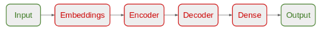

# English-German Translation App
In this project I created a model using LSTM which takes English texts and translates them to German.

This subject is actually part of machine translation with RNN. Depending on the use-case, we set up our RNN to handle inputs and outputs differently. For this project, I used a many-to-many process where the input is a sequence of English words and the output is a sequence of German words.

LSTM is a type of RNN which has a longer term mermory.

## Preprocessing:

Tokenization: Convert the text to numerical values. Each word and punctuation mark will be given a unique ID.
When we run the tokenizer, it creates a word index, which is then used to convert each sentence to a vector.

Padding: When we feed our sequences of word IDs into the model, each sequence needs to be the same length. To achieve this, padding is added.

## Models

The layer We need for the model is shown above.

Inputs:Input sequences are fed into the model with one word for every time step. Each word is encoded as a unique integer or one-hot encoded vector that maps to the English dataset vocabulary.

Embedding Layers: Embeddings are used to convert each word to a vector. The size of the vector depends on the complexity of the vocabulary.

Recurrent Layers (Encoder): This is where the context from word vectors in previous time steps is applied to the current word vector.

Dense Layers (Decoder): These are typical fully connected layers used to decode the encoded input into the correct translation sequence.

Outputs: The outputs are returned as a sequence of integers or one-hot encoded vectors which can then be mapped to the German dataset vocabulary.

For this project I created model with normal LSTM layers. And then a model with bidirectional LSTM layers. Using bidirection allows a LSTM layer to not only use previous info but also the future information.

Initially I used Adam optimizer for these models. But to see if anything's diffirent I compiled them with SGD optimizer too.

# Results:

model1(LSTM-Adam):

loss: 0.2293 - accuracy: 0.9178 - val_loss: 2.3676 - val_accuracy: 0.7438

model2(Bidirectional LSTM-Adam):

loss: 0.1319 - accuracy: 0.9232 - val_loss: 2.7542 - val_accuracy: 0.7379

model3(LSTM-SGD):

loss: 2.3362 - accuracy: 0.6544 - val_loss: 2.3269 - val_accuracy: 0.6543

Model4(Bidirectional LSTM-SGD):

loss: 2.3013 - accuracy: 0.6544 - val_loss: 2.3027 - val_accuracy: 0.6543

